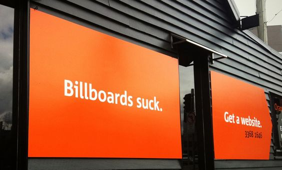

In early 2013 I interviewed at [Orange Digital](http://www.orangedigital.com.au) and soon after began working there part time. Sandra and I were recently back from four and a half months in Europe and I was struggling to get myself reengaged with uni. I'd all but [decided I was dropping out](/blog/dont-settle-stay-hungry-stay-foolish/) when we left to go traveling. 

In the early days I was freelancing on the side and still working hospitality on the weekends but part-time quickly turned to full-time and then I never enrolled for my next semester. I was having a great time earning and learning in the industry again.. 

I spent almost 2 years at Orange building awesome sites and mobile apps with a fantastic team of people.

I started at Orange with a focus on WordPress development but over the course of about six months or so I transitioned to also developing Drupal sites. I was a bit reluctant at first but this new knowledge made me a better WordPress developer and added another CMS to my toolkit which I greatly value.

<blockquote class="instagram-media" data-instgrm-captioned data-instgrm-permalink="https://www.instagram.com/p/h26JtrvlKl/?utm_source=ig_embed&amp;utm_campaign=loading" data-instgrm-version="12" style=" background:#FFF; border:0; border-radius:3px; box-shadow:0 0 1px 0 rgba(0,0,0,0.5),0 1px 10px 0 rgba(0,0,0,0.15); margin: 1px; max-width:540px; min-width:326px; padding:0; width:99.375%; width:-webkit-calc(100% - 2px); width:calc(100% - 2px);">
 <a href="https://www.instagram.com/p/h26JtrvlKl/?utm_source=ig_embed&amp;utm_campaign=loading" style=" background:#FFFFFF; line-height:0; padding:0 0; text-align:center; text-decoration:none; width:100%;" target="_blank"> 
 

 
 

 

 
<svg width="50px" height="50px" viewBox="0 0 60 60" version="1.1" xmlns="https://www.w3.org/2000/svg" xmlns:xlink="https://www.w3.org/1999/xlink"><g stroke="none" stroke-width="1" fill="none" fill-rule="evenodd"><g transform="translate(-511.000000, -20.000000)" fill="#000000"><g><path d="M556.869,30.41 C554.814,30.41 553.148,32.076 553.148,34.131 C553.148,36.186 554.814,37.852 556.869,37.852 C558.924,37.852 560.59,36.186 560.59,34.131 C560.59,32.076 558.924,30.41 556.869,30.41 M541,60.657 C535.114,60.657 530.342,55.887 530.342,50 C530.342,44.114 535.114,39.342 541,39.342 C546.887,39.342 551.658,44.114 551.658,50 C551.658,55.887 546.887,60.657 541,60.657 M541,33.886 C532.1,33.886 524.886,41.1 524.886,50 C524.886,58.899 532.1,66.113 541,66.113 C549.9,66.113 557.115,58.899 557.115,50 C557.115,41.1 549.9,33.886 541,33.886 M565.378,62.101 C565.244,65.022 564.756,66.606 564.346,67.663 C563.803,69.06 563.154,70.057 562.106,71.106 C561.058,72.155 560.06,72.803 558.662,73.347 C557.607,73.757 556.021,74.244 553.102,74.378 C549.944,74.521 548.997,74.552 541,74.552 C533.003,74.552 532.056,74.521 528.898,74.378 C525.979,74.244 524.393,73.757 523.338,73.347 C521.94,72.803 520.942,72.155 519.894,71.106 C518.846,70.057 518.197,69.06 517.654,67.663 C517.244,66.606 516.755,65.022 516.623,62.101 C516.479,58.943 516.448,57.996 516.448,50 C516.448,42.003 516.479,41.056 516.623,37.899 C516.755,34.978 517.244,33.391 517.654,32.338 C518.197,30.938 518.846,29.942 519.894,28.894 C520.942,27.846 521.94,27.196 523.338,26.654 C524.393,26.244 525.979,25.756 528.898,25.623 C532.057,25.479 533.004,25.448 541,25.448 C548.997,25.448 549.943,25.479 553.102,25.623 C556.021,25.756 557.607,26.244 558.662,26.654 C560.06,27.196 561.058,27.846 562.106,28.894 C563.154,29.942 563.803,30.938 564.346,32.338 C564.756,33.391 565.244,34.978 565.378,37.899 C565.522,41.056 565.552,42.003 565.552,50 C565.552,57.996 565.522,58.943 565.378,62.101 M570.82,37.631 C570.674,34.438 570.167,32.258 569.425,30.349 C568.659,28.377 567.633,26.702 565.965,25.035 C564.297,23.368 562.623,22.342 560.652,21.575 C558.743,20.834 556.562,20.326 553.369,20.18 C550.169,20.033 549.148,20 541,20 C532.853,20 531.831,20.033 528.631,20.18 C525.438,20.326 523.257,20.834 521.349,21.575 C519.376,22.342 517.703,23.368 516.035,25.035 C514.368,26.702 513.342,28.377 512.574,30.349 C511.834,32.258 511.326,34.438 511.181,37.631 C511.035,40.831 511,41.851 511,50 C511,58.147 511.035,59.17 511.181,62.369 C511.326,65.562 511.834,67.743 512.574,69.651 C513.342,71.625 514.368,73.296 516.035,74.965 C517.703,76.634 519.376,77.658 521.349,78.425 C523.257,79.167 525.438,79.673 528.631,79.82 C531.831,79.965 532.853,80.001 541,80.001 C549.148,80.001 550.169,79.965 553.369,79.82 C556.562,79.673 558.743,79.167 560.652,78.425 C562.623,77.658 564.297,76.634 565.965,74.965 C567.633,73.296 568.659,71.625 569.425,69.651 C570.167,67.743 570.674,65.562 570.82,62.369 C570.966,59.17 571,58.147 571,50 C571,41.851 570.966,40.831 570.82,37.631"></path></g></g></g></svg>

 
 View this post on Instagram

 

 

 

 

 

 

 

 

 

</a> 
 <a href="https://www.instagram.com/p/h26JtrvlKl/?utm_source=ig_embed&amp;utm_campaign=loading" style=" color:#000; font-family:Arial,sans-serif; font-size:14px; font-style:normal; font-weight:normal; line-height:17px; text-decoration:none; word-wrap:break-word;" target="_blank">Late night at work. Last one before 4 weeks off.</a>
 
A post shared by <a href="https://www.instagram.com/mischacolley/?utm_source=ig_embed&amp;utm_campaign=loading" style=" color:#c9c8cd; font-family:Arial,sans-serif; font-size:14px; font-style:normal; font-weight:normal; line-height:17px;" target="_blank"> Mischa Colley</a> (@mischacolley) on <time style=" font-family:Arial,sans-serif; font-size:14px; line-height:17px;" datetime="2013-12-13T10:10:09+00:00">Dec 13, 2013 at 2:10am PST</time>

</blockquote> 

Much of my time at Orange was also spent with a focus on building responsive sites and improving workflows surrounding those type of projects. I'd been doing responsive stuff for quite a while and I was very passionate about it and sharing my knowledge. 

In my time at Orange I:

- Built sites both large and small. I worked on large custom WordPress sites for Government, large Drupal sites for schools, small sites, medium sites, old sites, new sites and landing pages and more. 
  
- I built numerous e-commerce sites in both WordPress and Drupal working with things like Jigoshop, WooCommerce and Drupal Commerce and Ubercart. This work involved theming, custom development, product entry, gateway integration and testing etc.

- For many of the sites I arranged quotes on hosting, did the server provisioning and initial live deployment among other server administration tasks. 

Other tasks included:

- SEO development and Analytics / GWT setup
- On and off site client training sessions with individuals and teams
- On and off site client meetings
- Assisting with development quotes for the sales team
- Mentoring junior developers and interns 
- Team meetings & training presentations 
- Working with remote staff

- Together with some of the other devs I helped establish GIT as part of our development workflow along with championing the adoption of Sass

<blockquote class="instagram-media" data-instgrm-captioned data-instgrm-version="6" style=" background:#FFF; border:0; border-radius:3px; box-shadow:0 0 1px 0 rgba(0,0,0,0.5),0 1px 10px 0 rgba(0,0,0,0.15); margin: 1px; max-width:658px; padding:0; width:99.375%; width:-webkit-calc(100% - 2px); width:calc(100% - 2px);">
 
 

 
 <a href="https://www.instagram.com/p/uHIjbEvlDy/" style=" color:#000; font-family:Arial,sans-serif; font-size:14px; font-style:normal; font-weight:normal; line-height:17px; text-decoration:none; word-wrap:break-word;" target="_blank">Git it Together</a>
 
A photo posted by Mischa Colley (@mischacolley) on <time style=" font-family:Arial,sans-serif; font-size:14px; line-height:17px;" datetime="2014-10-13T23:40:35+00:00">Oct 13, 2014 at 4:40pm PDT</time>

</blockquote>

- Because of my love for tooling and everything new and shiny in our industry I was able to transition the whole team to tools like Trello and Slack

## The Billboard Place

When I started we were located on the corner of Upper Roma and Milton Road and were better known, at least to all my friends, as *"The Billboard"* place. 

The Billboard place was fun but it quickly got a little cramped as we started to grow.

It was here that I began working more and more with my new *friend* Drupal. Drupal and I spent a lot of late nights together!

## The Valley Office

I think I'd been with Orange about a year when we moved to the [Valley Office](https://www.google.com.au/maps/place/orange+digital/@-27.4565756,153.0343612,3a,75y,306.34h,90t/data=!3m4!1e1!3m2!1sq_bDpJ40HH0AAAQo8DNcBg!2e0!4m2!3m1!1s0x0:0xb27f817982a90d69?sa=X&ved=0ahUKEwinm4S71N_KAhUMJJQKHTxFBEsQoB8IazAN). This was a major upgrade to a much nicer open plan space that had been custom renovated. 

<blockquote class="instagram-media" data-instgrm-captioned data-instgrm-version="6" style=" background:#FFF; border:0; border-radius:3px; box-shadow:0 0 1px 0 rgba(0,0,0,0.5),0 1px 10px 0 rgba(0,0,0,0.15); margin: 1px; max-width:658px; padding:0; width:99.375%; width:-webkit-calc(100% - 2px); width:calc(100% - 2px);">
 
 

 
 <a href="https://www.instagram.com/p/mxPrL6PlGX/" style=" color:#000; font-family:Arial,sans-serif; font-size:14px; font-style:normal; font-weight:normal; line-height:17px; text-decoration:none; word-wrap:break-word;" target="_blank">Waiting on the back steps of our new office for the big reveal</a>
 
A photo posted by Mischa Colley (@mischacolley) on <time style=" font-family:Arial,sans-serif; font-size:14px; line-height:17px;" datetime="2014-04-14T11:59:45+00:00">Apr 14, 2014 at 4:59am PDT</time>

</blockquote>

We were all pretty excited because among other things we could now come to the office and get breakfast every morning. 

<blockquote class="instagram-media" data-instgrm-captioned data-instgrm-version="6" style=" background:#FFF; border:0; border-radius:3px; box-shadow:0 0 1px 0 rgba(0,0,0,0.5),0 1px 10px 0 rgba(0,0,0,0.15); margin: 1px; max-width:658px; padding:0; width:99.375%; width:-webkit-calc(100% - 2px); width:calc(100% - 2px);">
 
 

 
 <a href="https://www.instagram.com/p/mxQB9OPlG2/" style=" color:#000; font-family:Arial,sans-serif; font-size:14px; font-style:normal; font-weight:normal; line-height:17px; text-decoration:none; word-wrap:break-word;" target="_blank">Watching breakfast be prepared by our new office chef and barista</a>
 
A photo posted by Mischa Colley (@mischacolley) on <time style=" font-family:Arial,sans-serif; font-size:14px; line-height:17px;" datetime="2014-04-14T12:02:52+00:00">Apr 14, 2014 at 5:02am PDT</time>

</blockquote>

The move saw us take on many more bigger and better clients and a number of new people joined the team. I found myself teaching more junior devs and throwing myself into larger and more complex projects where I was testing my knowledge and skill and happily finding that mostly I now really knew my stuff. 

## ThinkDo - The Brains of Orange Digital

For the majority of the time I was at Orange Digital I spent 1 day a week in our innovation office [ThinkDo](http://thinkdo.com.au/), working on internal projects. I worked on three different projects during that time. We learned a lot and lots of those lessons have gone into inventing, building and delivering disruptive business innovations for Orange clients. The lessons I learned during ThinkDo time are serving me well today, including how important discovery and down-time time is for staying sharp in this industry.

<blockquote class="instagram-media" data-instgrm-captioned data-instgrm-version="6" style=" background:#FFF; border:0; border-radius:3px; box-shadow:0 0 1px 0 rgba(0,0,0,0.5),0 1px 10px 0 rgba(0,0,0,0.15); margin: 1px; max-width:658px; padding:0; width:99.375%; width:-webkit-calc(100% - 2px); width:calc(100% - 2px);">
 
 

 
 <a href="https://www.instagram.com/p/he0RTGPlF3/" style=" color:#000; font-family:Arial,sans-serif; font-size:14px; font-style:normal; font-weight:normal; line-height:17px; text-decoration:none; word-wrap:break-word;" target="_blank">Our next-door neighbors like our new office toys</a>
 
A photo posted by Mischa Colley (@mischacolley) on <time style=" font-family:Arial,sans-serif; font-size:14px; line-height:17px;" datetime="2013-12-04T01:36:59+00:00">Dec 3, 2013 at 5:36pm PST</time>

</blockquote>

### 1 - Nodunno

Nodunno is an iOS App we developed over about a year. It is still available for [download on the App Store](https://itunes.apple.com/au/app/nodunno/id795605504?mt=8) but I don't believe it has had an update in a while. The basic premise was:

> Making a decision can be so hard right? With Nodunno, it’s easy. You pick three options (text or pics) and send it to your buddies. Once they tap on your question, it shows the three options and they only have a few seconds to pick one. You get a guaranteed response, every time.

We had a team of 5-6 split between, design, dev and marketing. I built the promotional website and did Front-End work on the iOS app. They marketing guys and girls had a lot of fun doing promotional videos and other things for the project. Like this one!

<iframe class="responsive" src="https://www.youtube.com/embed/NdbcW9kMRYM" frameborder="0" allowfullscreen></iframe>

And this slightly more tasteful one.

<iframe class="responsive" src="https://player.vimeo.com/video/90093944" frameborder="0" webkitallowfullscreen mozallowfullscreen allowfullscreen></iframe>

I learned a lot on this team about:

- developing and submitting apps to the App Store
- building effective landing pages and Facebook apps to drive campaigns
- marketing and SEO dos and donts

<blockquote class="instagram-media" data-instgrm-captioned data-instgrm-version="6" style=" background:#FFF; border:0; border-radius:3px; box-shadow:0 0 1px 0 rgba(0,0,0,0.5),0 1px 10px 0 rgba(0,0,0,0.15); margin: 1px; max-width:658px; padding:0; width:99.375%; width:-webkit-calc(100% - 2px); width:calc(100% - 2px);">
 
 

 
 <a href="https://www.instagram.com/p/kTO6eUPlKX/" style=" color:#000; font-family:Arial,sans-serif; font-size:14px; font-style:normal; font-weight:normal; line-height:17px; text-decoration:none; word-wrap:break-word;" target="_blank">Just a regular day at #thinkdo</a>
 
A photo posted by Mischa Colley (@mischacolley) on <time style=" font-family:Arial,sans-serif; font-size:14px; line-height:17px;" datetime="2014-02-12T03:13:06+00:00">Feb 11, 2014 at 7:13pm PST</time>

</blockquote>

Ultimately our biggest lesson was that you need to launch quickly and fail fast. We learned our lesson for the next two projects and went to the other extreme. Taking a product to market in just 3 days with only 3 people per team!

### 2 - #Knowenough

Matt, Tom and I took our idea in a more serous "improve the world" direction this time. We developed the concept for an "Enlightened" fashion product. We launched a [Kickstarter](https://www.kickstarter.com/) campaign for it and raised a couple of hundred bucks but ultimately our project wasn't chosen to continue internally and we didn't reach our funding goal. I took away a lot from this project about how Kickstarter works and how simple is best. There isn't much online to show for the project anymore but here is a video we made about it for the Kickstarter campaign. 

<iframe class="responsive" src="https://www.youtube.com/embed/gjDk42vH2HM" frameborder="0" allowfullscreen></iframe>

The team that did win this round of innovation built [The Coffee Post](http://thecoffeepost.com.au/) which I believe is still an operating business. 

### 3 - 1BitWally

For our next round Matt, Tom and I took it pretty easy and had a lot of fun. We created a stupid little web game where you had to find a hidden pixel on the screen. If you clicked it you got to leave a message on the wall of the site. It quickly turned into an obscene mess but it was fun while it lasted. On the surface it appeared hard to solve but if you knew anything about html or just even used your tab key you could solve it in about 2 seconds (until we made some edits). 

Long story short we somehow got a lot of traffic from Reddit, had a new submission at least ever second and crashed our server 3+ times, got the site "hacked", had people un-hack it for us ... 

Not sure exactly what we learn't from this project. The Internet is crazy?

Sadly 1bitwally is no longer online but you can get a feel for it's *brilliance* thanks to the [Internet Archive](https://web.archive.org/web/20150509204942/http://1bitwally.com/). Have a listen to the track below (we had it auto playing in the background ) as you view it and imagine a new message appearing almost every second across the page.  

<iframe width="100%" height="166" scrolling="no" frameborder="no" src="https://w.soundcloud.com/player/?url=https%3A//api.soundcloud.com/tracks/58976109&color=ff5500" class="soundcloud"></iframe>

I learn't a lot both personally and professional in my time at Orange and ThinkDo. I left in 2014 to spend time with my newborn son Finn and move our family back to Byron. 

Since I left Orange, the ThinkDo teams have continued to do wonderful things like [sendyourfriendapenisdrawing.com](http://www.sendyourfriendapenisdrawing.com/).

