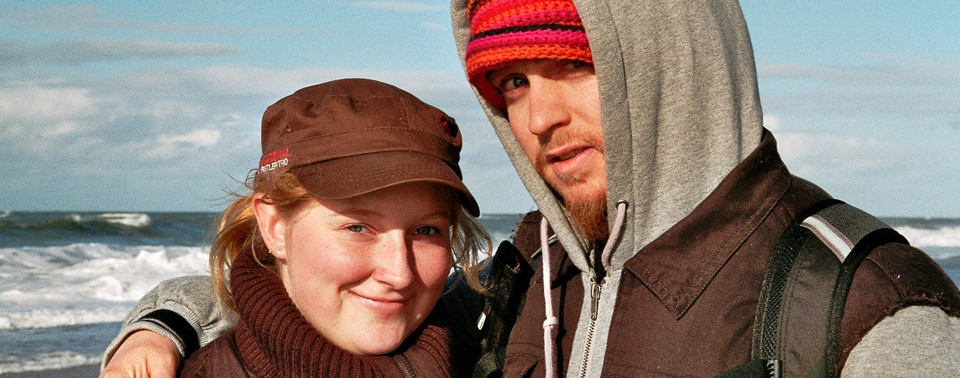
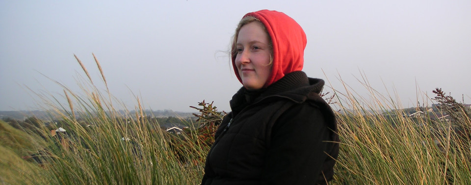
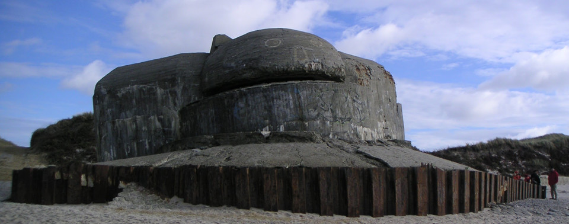
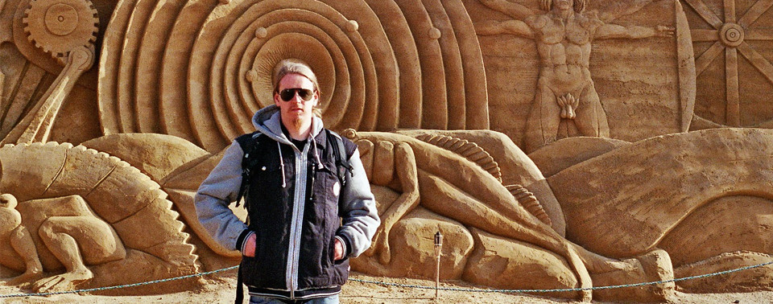

In October Sandra had two weeks off from work and study so along with her sister Meike and Meike's boyfriend Sven we headed to Denmark for two weeks. We rented a nice little house nestled in amongst the windblown Danish sand dunes. 

We got up early in the dark freezing cold and drove for about 4 hours till we reached a small fishing/tourist town called [Hvide Sande](http://en.wikipedia.org/wiki/Hvide_Sande). We had to wait around a few hours for the key so we had a bit of a look around the place. 

The most interesting thing for me was we found an old WWII bunker in the middle of the town....was pretty strange after reading lots of WWII history and than all of a sudden be standing on a real live bunker. 

This one never saw any fighting though .... must have been pretty bloody cold, lonely and boring for the poor young soldiers which had to stay there. 

The part of Denmark we where in is pretty cool country.....just all rolling sand dunes as far as the eye can see....thatched and new black roofed house (black to keep the heat in) nestled in amongst them and the whole country side is littered by flag polls flying the red an white Danish flag...... very patriotic. 

I can see why though because that stretch of coast is a German holiday area and the whole time we where there we didn't come across anyone who didn't speak German.....if they weren't German themselves. That was the only thing that was not so good for me because it didn't really feel like being in another country. 

The beach was cool......not even close to how nice Byron Bay is but it was cool to be looking out on the North Sea. The beach also had 8-12 bunkers in varying states of decay strewn along the beach....they are massive concert monstrosities. We had a fun day exploring them but it is kind of sad to see them there too. 

<figure>
    
    <figcaption>These bunkers are massive and they go all the way up and down the coastline.</figcaption>
</figure>

<figure>
    
    <figcaption>Exploring some more bunkers.</figcaption>
</figure>

We got up to a few other things over our time there. Lots of big walks, tried our hand at some fishing, watched the sun rise and played lots of card and board games. We also visited a sand sculpture competition and Sandra and I accidentally walked out of a supermarket with a cartoon of beer we somehow managed not to pay for. Oops! I enjoyed that beer very much though! 

<figure>
    
    <figcaption>This was at a sand sculpture competition that happened to be on while we were up there. Saw some amazing sculptures.</figcaption>
</figure>

# Back to HH

On the way back into Hamburg we hit a major traffic jam (or *stop and go* as I learned they are often referred to in German) .... 18km of none moving cars and so a journey that was meant to take roughly 4 hours took near on 8. 

We got out the map and Meike did some nice lane changes and than we hit the countryside and back roads. It didn't make the journey any faster but at least we weren't sitting still anymore and felt like we were making progress. 

On arrival back in Hamburg it was pretty amazing for me because in just two weeks the trees had turned from there normal green to almost full *herbst* colors.....dropping there leaves and turning some amazing colours. It was also noticeable fucking colder! 